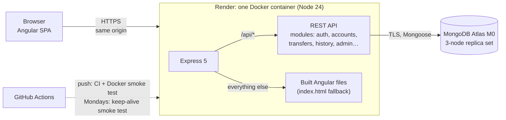
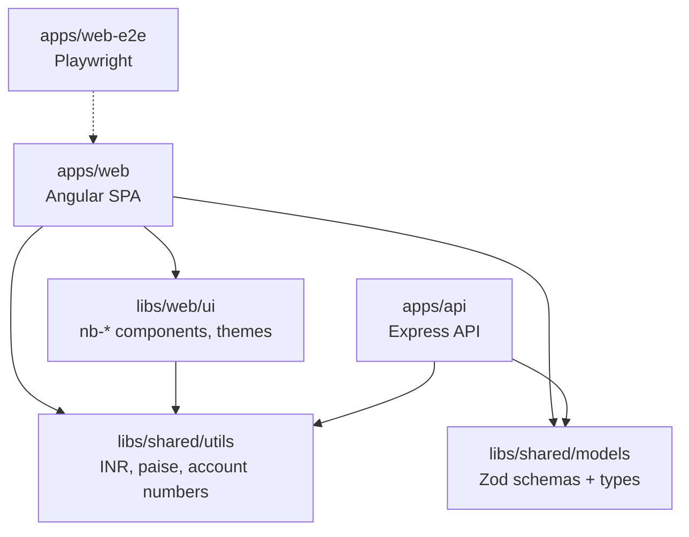
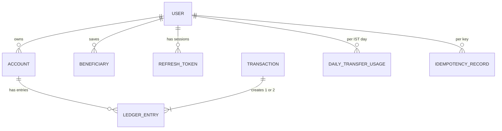
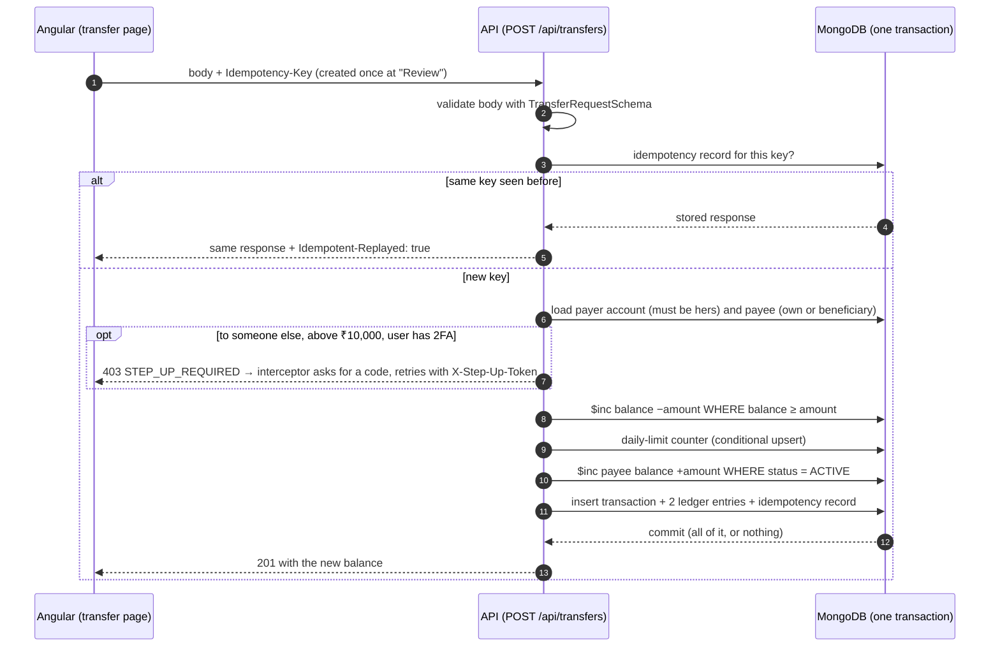
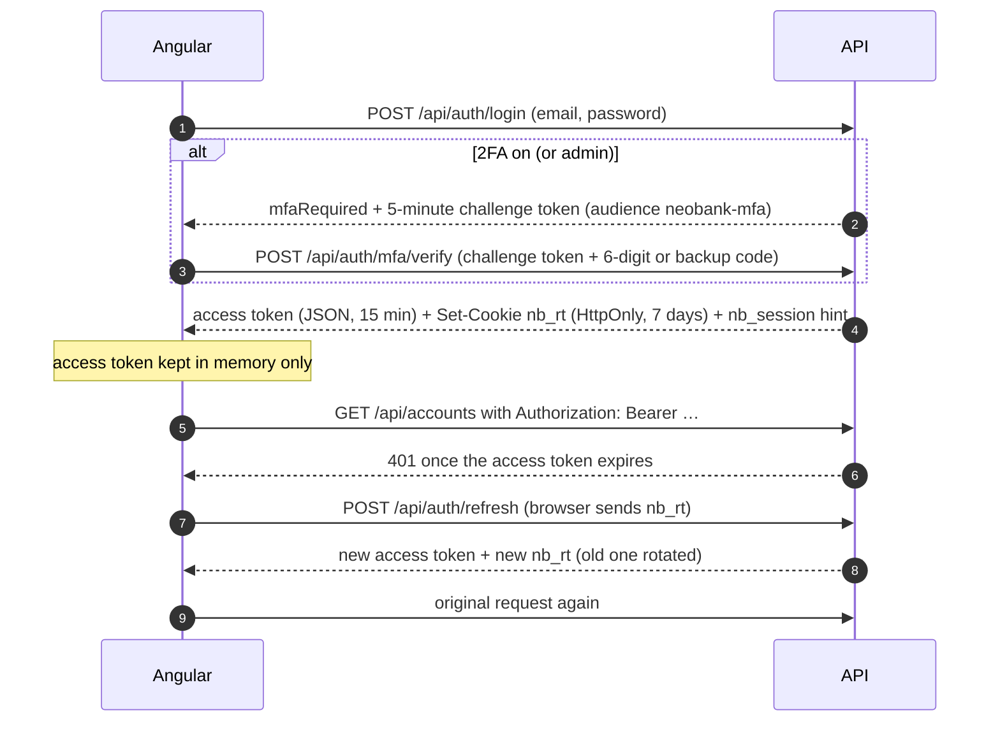
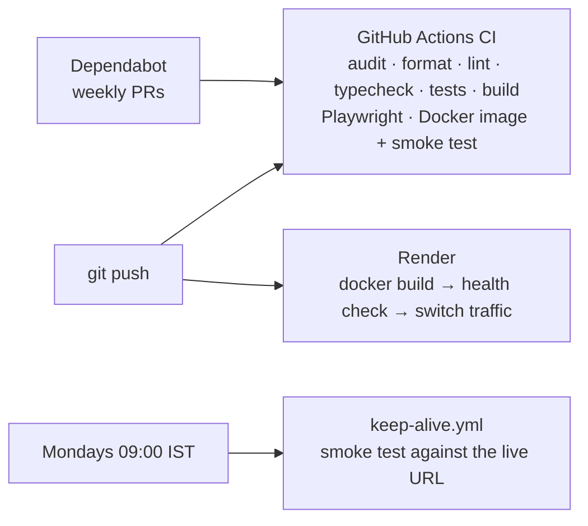

# Architecture

How NeoBank fits together, and how its two most important flows work: moving money and signing in. For each feature's endpoints and rules, see [features.md](features.md). For _why_ things are built this way, see [decisions/](decisions/).

## The big picture

- **One service, one URL.** Express serves both the API and the Angular app. Because they share an origin, there is no CORS, and the refresh cookie can be `SameSite=Strict`.
- **A replica set everywhere.** Atlas is one, and in development the API starts an in-memory replica set (`mongodb-memory-server`) when `MONGODB_URI` is empty. Money movement relies on multi-document transactions, which need a replica set.
- **Render** builds the `Dockerfile` on every push to `main` and restarts the container if `/api/health` stops answering. Free services sleep after 15 minutes idle.

## The monorepo

- Each project is tagged `scope:web`, `scope:api` or `scope:shared`. ESLint fails the build if `web` imports `api` code or the other way round. Both may import `shared`.
- **`libs/shared/models` is the contract.** A schema such as `TransferRequestSchema` is defined once. The API validates request bodies with it, Angular forms validate input with it, and the OpenAPI document at `/api/docs` is generated from it. The three can't drift apart.
- Shared schemas use `zod/mini` (small in the browser); the API's own schemas use classic `zod`. Both run on Zod's shared core.

### Inside the API (`apps/api/src`)

| Folder               | What lives there                                                                                                            |
| -------------------- | --------------------------------------------------------------------------------------------------------------------------- |
| `main.ts`, `app.ts`  | Start-up (env check, DB connect, seeding) and the Express app (security headers, compression, routes, static files)         |
| `config/`            | Environment variables, validated by Zod at start-up: the API refuses to start in production without its secrets             |
| `middleware/`        | `requireAuth`, `requireRole`, `validateBody`, the error handler                                                             |
| `modules/<feature>/` | One folder per feature: `*.routes.ts` (HTTP), `*.service.ts` (business rules), `*.model.ts` (Mongoose), `*.spec.ts` (tests) |
| `lib/`               | Small, framework-free helpers: TOTP, AES-GCM `crypto-box`, CSV, IST dates                                                   |
| `seed/`              | Demo users with 6 months of history, and the admin user                                                                     |

Routes only translate HTTP to service calls. Services hold the rules and are what the tests exercise most.

### Inside the web app (`apps/web/src/app`)

| Folder                | What lives there                                                                                                         |
| --------------------- | ------------------------------------------------------------------------------------------------------------------------ |
| `core/<feature>/`     | `*.api.ts` (HTTP calls, responses parsed with the shared schemas) and, for shared state, `*.store.ts` (NgRx SignalStore) |
| `core/http/`          | Interceptors: attach the access token, refresh once on `401`, map errors                                                 |
| `core/security/`      | The step-up interceptor and its lazy-loaded "Confirm it's you" dialog                                                    |
| `features/<feature>/` | Pages (smart components that inject stores) and their presentational pieces                                              |

State flows one way: a page calls a store method → the store calls the API → the store patches its state → every component reading that signal updates. Presentational components only use `input()` and `output()`.

## Data model

- **Money is an integer number of paise** everywhere: in MongoDB, in the API, in Angular. Only `<nb-amount>` and the `inr` pipe turn it into `₹1,050.00`.
- A **transaction** is the business event (a deposit, a withdrawal, a transfer). A **ledger entry** is its effect on one account: `CREDIT` or `DEBIT`, with `balanceAfter`. Ledger entries are append-only, so an account's balance always equals its credits minus its debits.
- **Users** hold the password hash, lockout counters and 2FA state. Secrets (`passwordHash`, the encrypted TOTP secret, backup-code hashes) are excluded from queries unless explicitly selected.
- **Refresh tokens** are stored only as SHA-256 hashes, one chain per session (device).
- **Audit log** entries record every admin change, with who, what, when and why.

## Flow 1: moving money

A transfer from Priya to her saved beneficiary Ravi:

What makes it safe:

- **All or nothing.** Every write above is in one MongoDB transaction. If the payee turns out to be frozen, the payer's debit is rolled back too.
- **No overdraft, even under concurrency.** The debit is a conditional update (`balance >= amount`), not "read, check, write". Five withdrawals fired at once can't overdraw; a test proves it.
- **No double payment.** The idempotency record is written in the same transaction as the money movement. A retry, a double click or a lost response replays the stored response instead of paying again.
- **No sneaking past the daily limit.** The per-user, per-IST-day counter is updated with one conditional upsert, and its unique index stops two parallel transfers from both creating it.

Deposits and withdrawals follow the same pattern with one ledger entry.

## Flow 2: signing in and staying signed in

- **Access token:** a JWT signed with `JWT_ACCESS_SECRET`, carrying `sub` (user), `role`, `mfa` (whether 2FA was used) and `sid` (session). It lives in memory, so page scripts can't steal it from storage, and a reload restores it through `/refresh`.
- **Refresh token:** a random opaque value in an `HttpOnly`, `SameSite=Strict` cookie scoped to `/api/auth`. Every refresh **rotates** it. Reusing a rotated token more than 30 seconds later is treated as theft and revokes all of that user's sessions.
- **`nb_session` hint cookie:** holds no secret; it only tells the app whether calling `/refresh` on page load is worth it.
- **Step-up:** for users with 2FA on, risky actions (adding a beneficiary, large transfers to others) answer `403 STEP_UP_REQUIRED`. One Angular interceptor asks for a fresh code, gets a 5-minute single-action token from `/api/security/step-up`, and retries the original request with the same Idempotency-Key. Pages don't know step-up exists.
- **Three JWT audiences** (`neobank-web`, `neobank-mfa`, `neobank-step-up`) mean a challenge or step-up token can never be used as an access token.

## Delivery

- The `Dockerfile` has two stages: build everything with Nx, then copy only the API bundle, its 11 runtime packages and the Angular files into a small image that runs as the `node` user.
- In production Express sends a strict Content-Security-Policy, HSTS and `nosniff`; compresses with Brotli; caches hashed bundles for a year; and never caches `index.html` or API responses.
- `tools/smoke.mjs` checks a running copy end to end (headers, caching, deep links, OpenAPI, login, cookies, accounts). CI runs it against the Docker image, and the weekly workflow runs it against the live app.
